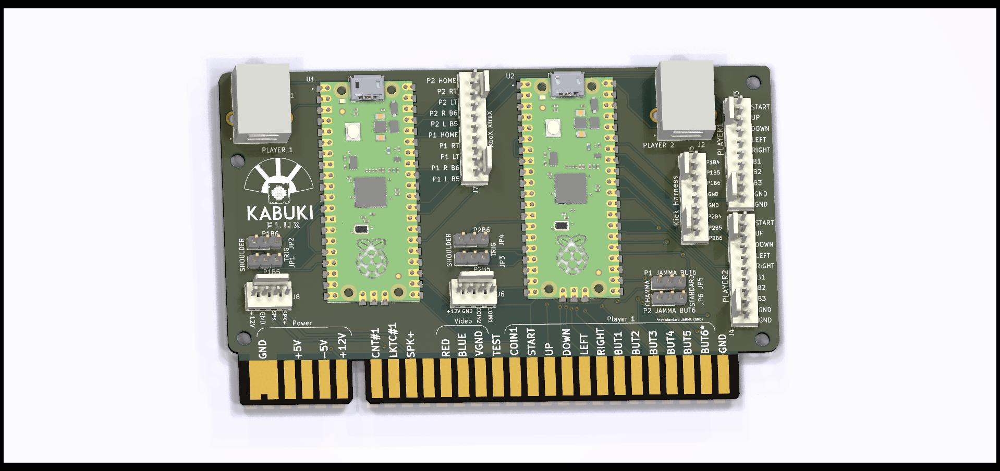
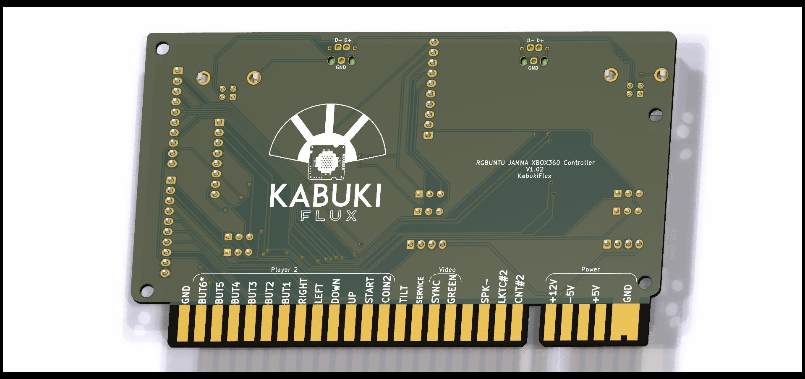
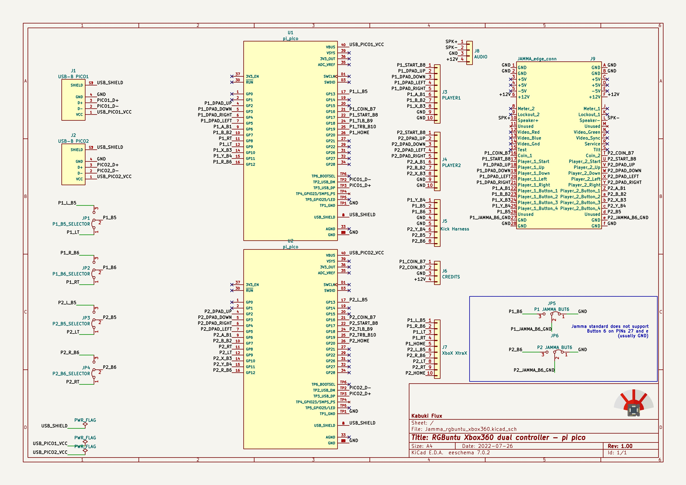
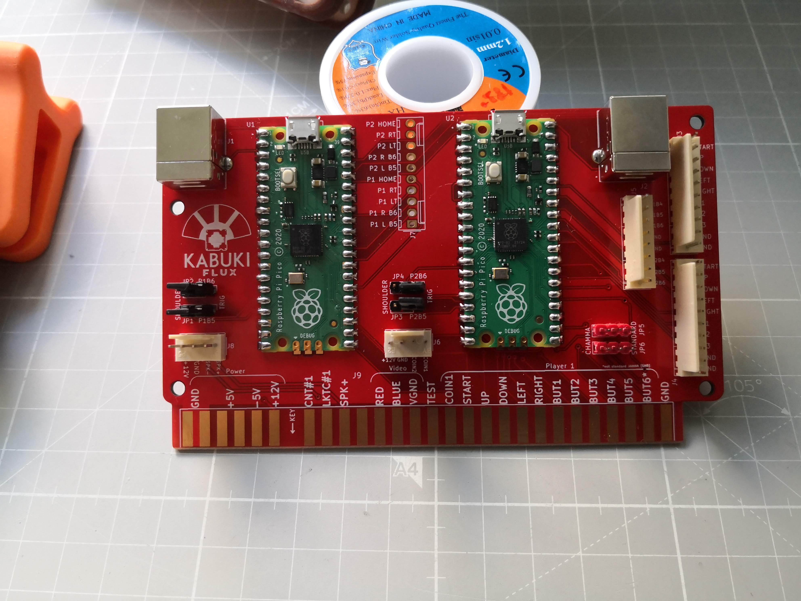
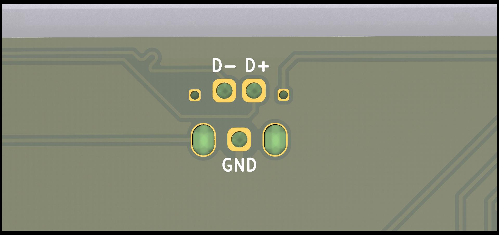
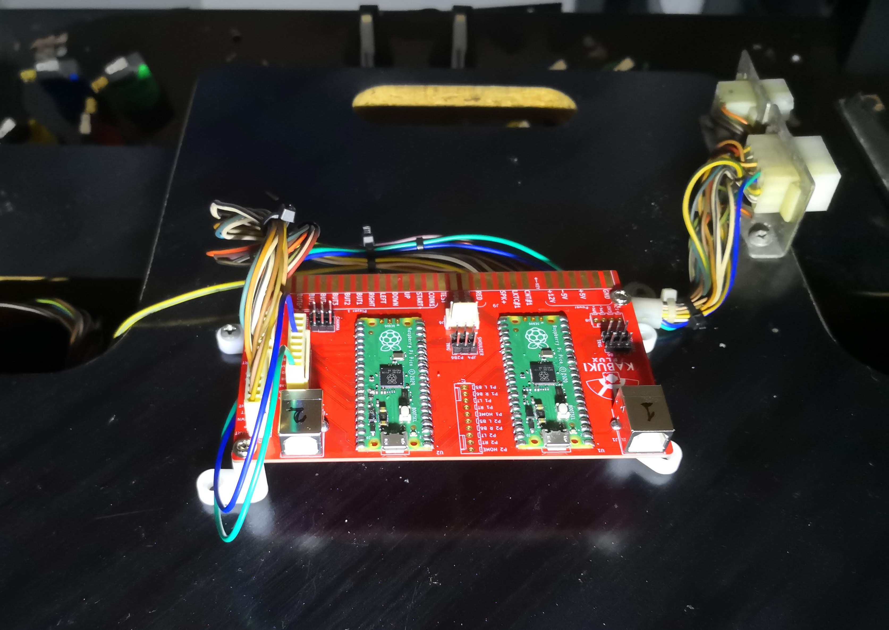
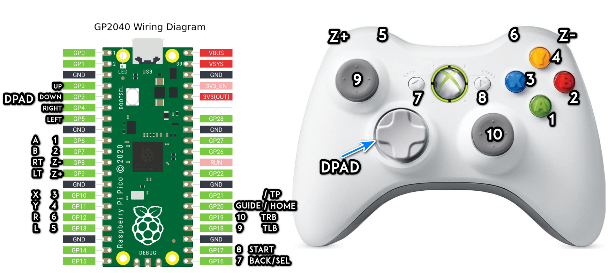

  <h1 align="center">JAMMA Xbox360 wired controller for RGBUNTU/PI/MiSTer 
  (cheap version, no protections)</h1>

## Table of contents

- [Description](#description)
- [Schematics](#schematics)
- [How to use](#how-to-use)
- [Bugs and feature requests](#bugs-and-feature-requests)
- [Copyright and license](#copyright-and-license)

## Description

This is intended to be a very cheap JAMMA 2 players board to USB adapter and <b> it was done during a live Twitch event (less than 4 hours)</b>.

It uses 2 pi-pico with 2 usb ports, one for the player 1 and other for the player 2, on the computer/raspberry/MiSTer side it will be automatically recognized as 2 Xbox360 wired controllers.

This board can be used as a JAMMA adapter or connected via the dirt cheap Molex KK254 connectors or the Aliexpress equivalent KF2510.

For the computer it can be connected via USB-B or the USB micro included on the PiPico

The software used for this board is the:

[FeralAI rp2040 xbox controller](https://github.com/FeralAI/GP2040)

now the project has become

[OpenStickCommunity GP2040-CE](https://github.com/OpenStickCommunity/GP2040-CE)

On the releases tab https://github.com/OpenStickCommunity/GP2040-CE/releases you can find the latest firmware GP2040-CE_X.X.X_Pico.uf2 to flash the pi pico

## Schematics

## How to use

1- Send to manufacture the board to JLCPCB or other PCB manufacturer. I recommend ENIG as the surface finish and Gold Fingers checked with 30º angle chamfer as well.

2- Get the components required, you can see here the Bill Of Materials [BOM](ibom.html)

3- Solder the components required by your setup (maybe you don't need audio input to the JAMMA edge or the Xtra Xbox buttons)

4- On the back on the board if you want to use the USB-B connectors check that you have soldered correctly the test points called D+ and D-, it will solder directly into the test points of the PiPico the GND point is not required but recommended.

5- Ensure your Arcade Cabinet doesn't send 12v on the coin circuitry, a switch is only allowed here. (There are some converters, use Google)

6- Connect each PiPico to the PC and you will see a new USB drive unit appear, copy the file .uf2 from here https://github.com/OpenStickCommunity/GP2040-CE/releases into the PiPico (GP2040-CE_X.X.X_Pico.uf2) it will restart and will be recognized as a Xbox360 wired controller.

7- Connect to your arcade cabinet via JAMMA or Molex (if your JAMMA wiring is very damaged) and enjoy your PC/MiSTer/Pi setup.

8- If the 2nd player appears as the 1st player swap the USB cables.

### Mappings and jumpers

The default mapping is done to match the one on RGBuntu OS (15khz Ubuntu OS, use Google).

<b>If you are one of the RGBuntu developers: please, if possible, can you remap Player 2 on all systems as well, xD? (at the time of writing this only P1 is currently mapped by default)</b>.

You can see here the mapping as a Xbox360 controller (default .uf2) but everything is labeled on the silkscreen.

- JP1, JP2, JP3 and JP4 choose the button 5 and 6 of each player to be mapped into the trigger or the shoulder buttons on the Xbox controller (I recommend the shoulder)

- JP5 and JP6 disable the button 6 of each player on the JAMMA edge to be compatible with the legacy JAMMA standard.

- J3 J4 and J5 are the Player 1, Player 2 and Kick Harness buttons respectively.

- J7 are non-standard used buttons just in case

- J6 is the dedicated coin connector, remember not to connect it if your coin mechanism sends 12vDC

- J8 is the dedicated audio input to send to the JAMMA edge in mono.

- <b>Read the documentation on https://github.com/OpenStickCommunity/GP2040-CE to see how to change the mappings in realtime like left or right stick and so.</b>

## Bugs and feature requests

Bugs and feature requests will be disabled as this is a dirty cheap example. If you want you can use it at your own risk.

### Errors

- To make it cheaper no overvoltage prevention or JAMMA wiring inductance protection has been included on the design.
- Audio speaker input has very short amperage path.

## Copyright and license

Code and documentation copyright KabukiFlux 2023. Code released under the [MIT License](https://github.com/KabukiFlux/JAMMA_2player_xbox360/blob/main/LICENSE).

